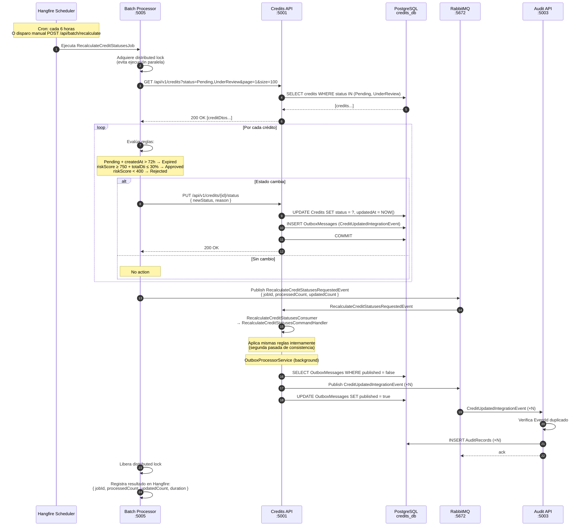

# Flujo Completo: Recálculo Batch de Estados

Flujo end-to-end del job de recálculo periódico que ajusta estados de créditos según reglas de negocio.

## Diagrama de secuencia

## Reglas de negocio aplicadas

| Condición | Estado anterior | Estado nuevo |
|---|---|---|
| `createdAt` > 72 h sin evaluación de riesgo | `Pending` | `Expired` |
| `riskScore ≥ 750` y `totalDti ≤ 30 %` | `UnderReview` | `Approved` |
| `riskScore < 400` | `UnderReview` | `Rejected` |
| `riskScore ≥ 600` y `totalDti ≤ 50 %` | — | Se mantiene `UnderReview` |

## Garantías

- **Idempotencia del job** — Si el job se ejecuta dos veces, la segunda iteración no cambia nada (los estados ya están actualizados).
- **Distributed lock de Hangfire** — Previene ejecuciones paralelas del mismo job.
- **Trazabilidad** — Cada crédito actualizado genera un `CreditUpdatedIntegrationEvent` auditado en `audit_db`.
