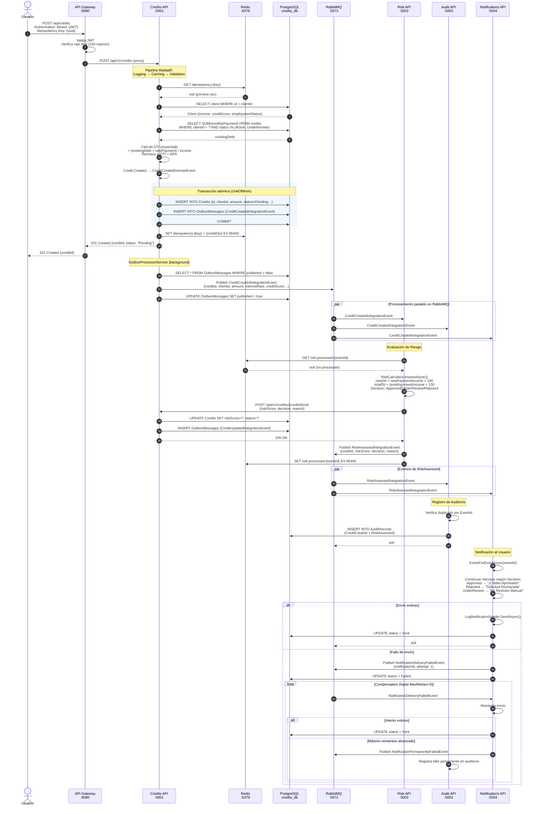

# Flujo Completo: Creación de Crédito

Flujo end-to-end desde que el usuario solicita un crédito hasta que recibe la notificación del resultado.

## Diagrama de secuencia

## Resumen del flujo

| Paso | Servicio | Acción |
|---|---|---|
| 1 | **Gateway** | Valida JWT, aplica rate limit, proxea al Credits API |
| 2 | **Credits API** | Verifica idempotencia en Redis |
| 3 | **Credits API** | Carga cliente, calcula DTI (máx 60%) |
| 4 | **Credits API** | Crea crédito + OutboxMessage en transacción atómica |
| 5 | **Credits API** | Devuelve `201 Created` con `creditId` |
| 6 | **Credits API** | OutboxProcessor publica `CreditCreatedIntegrationEvent` |
| 7 | **Risk API** | Evalúa riesgo: calcula DTI real + credit score → Approved/UnderReview/Rejected |
| 8 | **Risk API** | Llama `POST /credits/{id}/risk` para actualizar estado |
| 9 | **Risk API** | Publica `RiskAssessedIntegrationEvent` |
| 10 | **Audit API** | Registra `CreditCreated` y `RiskAssessed` de forma inmutable |
| 11 | **Notifications API** | Envía notificación según decisión; reintenta hasta 5 veces si falla |

## Garantías del sistema

- **Idempotencia**: Repetir la misma request con el mismo `Idempotency-Key` devuelve el mismo resultado sin duplicados.
- **At-least-once delivery**: El Outbox Pattern garantiza que el evento se publica incluso si el servicio reinicia justo después del commit.
- **Deduplicación de eventos**: Risk, Audit y Notifications verifican el `EventId` antes de procesar para evitar efectos secundarios duplicados.
- **Compensación**: Si la notificación falla, el ciclo de compensación reintenta automáticamente hasta 5 veces antes de registrar el fallo permanente en auditoría.
