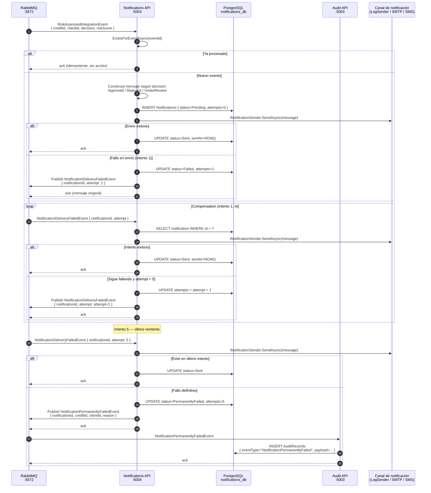

# Flujo Completo: Saga de Compensación de Notificaciones

Flujo detallado del mecanismo de reintentos cuando el envío de una notificación falla.

## Diagrama de secuencia



## Estados de una notificación

```
Pending → Sent           (envío exitoso en cualquier intento)
Pending → Failed         (fallo inicial, entra en compensación)
Failed  → Sent           (recuperado en reintento 1-4)
Failed  → PermanentlyFailed  (agotó MaxRetries = 5)
```

## Configuración

| Parámetro | Valor |
|---|---|
| `MaxRetries` | 5 |
| Sender activo | `LogNotificationSender` (simulado) |
| Interface reemplazable | `INotificationSender` |

## Observabilidad

- Cada intento queda registrado en `notifications_db` con el contador `attempts`.
- El fallo permanente genera un registro en `audit_db` con el snapshot completo.
- Las trazas de Jaeger muestran el span completo incluyendo todos los reintentos.
